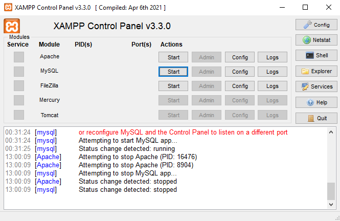
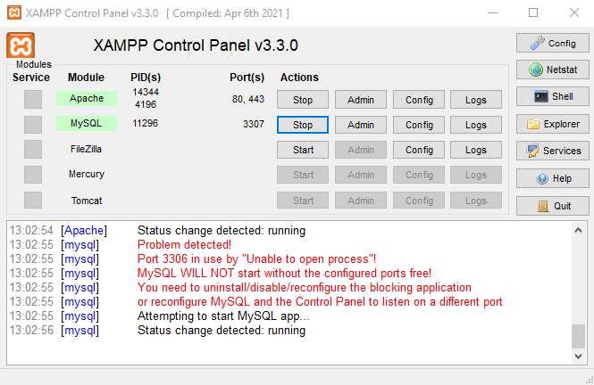
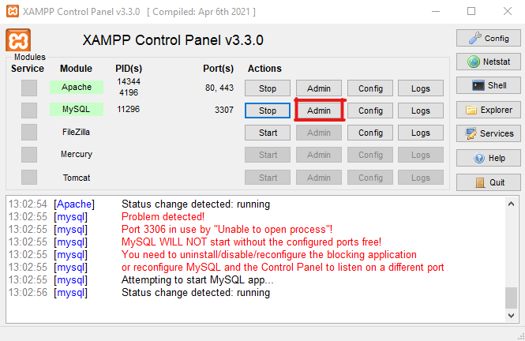
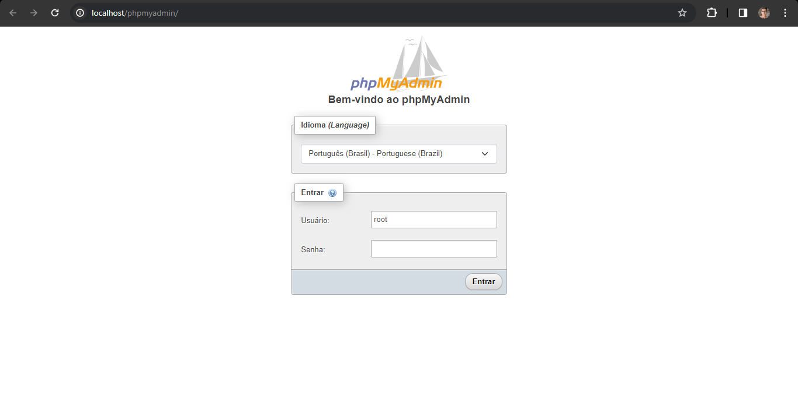

# Sistema de Ordem de Serviço (SOS) - IFSP Campus Cubatão

## Visão Geral

O Sistema de Ordem de Serviço (SOS) do IFSP Campus Cubatão é uma plataforma abrangente projetada para gerenciar eficientemente as solicitações de serviços dentro da instituição. Esta documentação integra a descrição geral do projeto com os requisitos e instruções específicas para a implementação usando o framework Laravel.

### Requisitos do Sistema (Laravel)

Para garantir uma implementação bem-sucedida do Sistema de Ordem de Serviço, certifique-se de que seu ambiente atenda aos seguintes requisitos:

- IDE: Obrigatório a instalação de uma IDE, preferencialmente Visual Studio Code, para a execução do projeto.
- PHP: Versão 7.4 ou superior;
- Composer: Ferramenta de gerenciamento de dependências para PHP;
- XAMPP: É obrigatório que os módulos do Apache e do MySQL sejam instalados;
- Banco de Dados: Deverá ser utilizado o arquivo "db_ordem_servico.sql" para a implementação do banco.

[Link para download dos arquivos](https://drive.google.com/drive/u/0/folders/1VWuVeIlOkSq6Cskq3Jz5pigge4yVc6LZ)

### Instalação do Projeto Laravel

**1. Clonar o Repositório:**

Abra um terminal e execute os seguintes comandos:

```bash
git clone https://github.com/vini-ayres/sistema-ordem-servico.git
cd sistema-ordem-servico
```

**2. Instalar Dependências do Composer:**

Execute o seguinte comando para instalar as dependências do projeto:

```bash
composer install
```

**3. Configurar Variáveis de Ambiente:**

Abra o arquivo `.laravel.env` em um editor de texto e configure as variáveis de ambiente, incluindo informações do banco de dados, de acordo com a configuração do ambiente XAMPP.

```env
APP_URL=http://localhost # Endereço principal do sistema
DB_CONNECTION=mysql # Nome do SGBD utilizado no sistema
DB_HOST=127.0.0.1 # Endereço IP do servidor do banco de dados
DB_PORT=3306 # Altere para a porta do MySQL no seu ambiente XAMPP
DB_DATABASE=db_ordem_servico # Nome do banco do sistema
DB_USERNAME=root # Nome de usuário para acesso ao banco
DB_PASSWORD=(deixe em branco) # Senha do usuário
```

**4. Ligar os módulos do XAMPP:**

Ligue somente os módulos de Apache e MySQL através do botão "start" para iniciar o servidor do sistema Laravel.
<br><br>



**5. Implementação do banco de dados no MySQL:**

Na tela do XAMPP, clique em "Admin" no módulo do MySQL. Em seguida abrirá uma nova aba no seu navegador com a tela do phpMyAdmin. Em usuário escreva "root" e deixe a senha em branco, e em seguida, clique em "Entrar"
<br><br>




**5. Iniciar o Servidor de Desenvolvimento:**

Execute o seguinte comando para iniciar o servidor Laravel:

```bash
php artisan serve
```

Acesse o sistema no navegador usando o endereço fornecido pelo comando acima.

---

**Nota:** Certifique-se de ter seguido todos os passos corretamente para garantir uma instalação bem-sucedida do Sistema de Ordem de Serviço.
